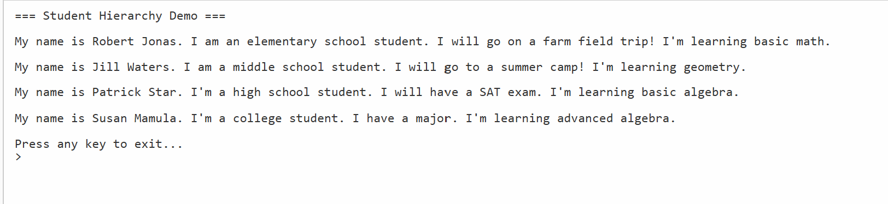

# 🎓 OOP Demo — Student Hierarchy with Polymorphism, Abstract Classes & Interfaces

A C# (.NET Core 3.1) object-oriented programming project that models
different types of students across education levels. The program uses an
abstract base class, concrete derived classes, and an interface to
demonstrate polymorphism, method overriding, and contract-based design.

---

## 📋 Features

- `Student` abstract base class defines shared read-only properties
  (`FirstName`, `LastName`, `StudentId`) and enforces the abstract
  method `ImportantThing()` in all derived classes
- Four concrete derived classes each override `ImportantThing()` and
  `ToString()` to reflect their education level:
  - `ElementarySchoolStudent` — goes on a farm field trip, learns basic math
  - `MiddleSchoolStudent` — goes to summer camp, learns geometry
  - `HighSchoolStudent` — has a SAT exam, learns basic algebra
  - `CollegeStudent` — has a major, learns advanced algebra
- `IMathClass` interface defines the `Math()` contract, implemented
  by all four student types using explicit interface implementation
- `Program.cs` stores all students in a `Student[]` array and iterates
  polymorphically using `foreach`

---

## ⚙️ How It Works

- `Student` is an `abstract` class — it cannot be instantiated directly
  but defines the shared constructor and read-only properties all
  student types inherit
- Each derived class calls the `base` constructor to set the student's
  name and ID, then overrides `ImportantThing()` and `ToString()` with
  its own education-level-specific output
- `IMathClass` is implemented using explicit interface implementation
  (`string IMathClass.Math()`) to avoid method ambiguity
- `Program.cs` creates one of each student type, stores them in a
  `Student[]` array, and loops through calling `ToString()` on each —
  the correct override is resolved automatically at runtime

---

## 💡 Example Output

```
=== Student Hierarchy Demo ===

My name is Robert Jonas. I am an elementary school student. I will go on a farm field trip! I'm learning basic math.

My name is Jill Waters. I am a middle school student. I will go to a summer camp! I'm learning geometry.

My name is Patrick Star. I'm a high school student. I will have a SAT exam. I'm learning basic algebra.

My name is Susan Mamula. I'm a college student. I have a major. I'm learning advanced algebra.

Press any key to exit...
```

---

## 🛠️ Technologies Used

| Technology                     | Purpose                                              |
|--------------------------------|------------------------------------------------------|
| C# 8.0                         | Core programming language                            |
| .NET Core 3.1                  | Runtime framework                                    |
| Abstract Class                 | `Student` base with enforced `ImportantThing()`      |
| Interface                      | `IMathClass` defining the `Math()` contract          |
| Explicit Interface Implementation | Resolves method ambiguity for `IMathClass.Math()` |
| Method Overriding              | `ToString()` and `ImportantThing()` per student type |
| Polymorphism                   | `Student[]` array storing all four derived types     |
| `foreach` loop                 | Iterates array and calls overridden methods          |

---

## 🎓 Learning Outcomes

- Designing an abstract base class with read-only properties and an
  abstract method that all derived classes must implement
- Using `base()` constructor calls to pass data up to the parent class
- Overriding `ToString()` to produce meaningful, class-specific output
- Implementing an interface using explicit interface implementation
  to avoid method name conflicts
- Storing derived types in a base class array for polymorphic iteration
- Understanding the difference between abstract classes and interfaces

---

## 📁 Folder Structure

```
E3-array/
├── E3-array/
│   ├── Program.cs                  ← Runner and all class definitions
│   ├── Exam3.csproj
├── LICENSE
└── README.md
```

---

## 🚀 How to Run

### Prerequisites
- [.NET Core 3.1 SDK](https://dotnet.microsoft.com/download/dotnet/3.1)

### Steps

```bash
# Clone the repository
git clone https://github.com/MissMarzelous/E3-array.git

# Navigate into the project folder
cd E3-array/E3-array

# Run the application
dotnet run
```

---

## 📸 Screenshots

### Console Output



---

## 👩‍💻 Author

**MissMarzelous** — C# .NET Core student project
